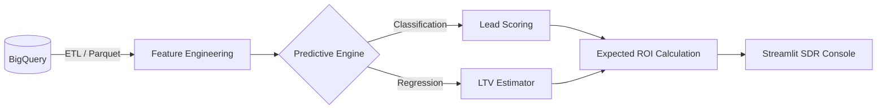
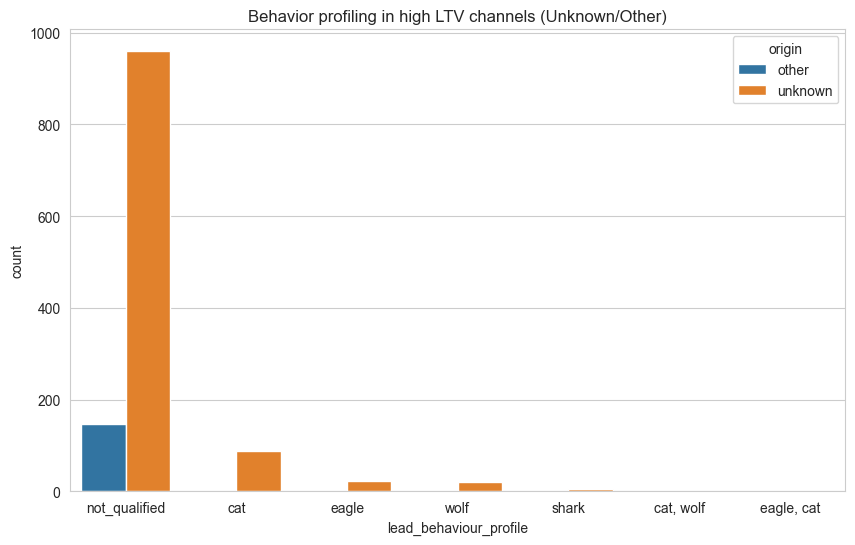

# 🚀 Olist Predictive Revenue Engine: Shark Detector
This project transforms raw data from Olist’s e-commerce ecosystem into a predictive revenue engine. Using advanced data forensics and machine learning techniques, the solution restores visibility into unattributed revenue and provides sales teams with a prioritization dashboard based on expected return on investment (Expected ROI).

--------------------------------------------------------------------------------

## 🚀 Live Demo
[](https://sdr-priority-console.streamlit.app/)

--------------------------------------------------------------------------------

## 🏗️ System Architecture
The solution follows a Cloud-Native architecture designed for high-performance inference:



**Ingestion:** Data is centralized in BigQuery to ensure referential integrity.

**Storage:** Use of the Parquet format to optimize I/O speed and reduce computing costs.

--------------------------------------------------------------------------------

## 📊 Datasets Used
The project uses real-world data from **Olist**, the largest department store on Brazilian marketplaces.
The architecture connects two major ecosystems:
- [Brazilian E-Commerce Public Dataset](https://www.kaggle.com/datasets/olistbr/brazilian-ecommerce?resource=download): Data from 100,000 orders placed between 2016 and 2018. Includes price, payment, product attributes, and geographic location.
- [Marketing Funnel by Olist](https://www.kaggle.com/datasets/olistbr/marketing-funnel-olist): Información de 8,000 Marketing Qualified Leads (MQLs). Detalla el viaje del vendedor desde el registro en una landing page hasta el cierre del contrato por un Sales Representative (SR).
- Strategic Integration: The data was centralized in BigQuery and processed in Parquet format to optimize training speed and cloud computing costs [Previous Conversation].

--------------------------------------------------------------------------------
## 🔍 Data Forensics: The Discovery of $113,000
The core of this project stemmed from an in-depth audit of our attribution channels. Upon analyzing leads classified as “unknown” or “other,” we discovered a critical “attribution leakage.”


While the marketing team was unaware of the untracked traffic, forensic analysis revealed that:
- The watches segment on unknown channels has a massive average LTV (Lifetime Value) of $113,629.

- The Health and Beauty segment features high-volume sellers (“Sharks”) who enter through direct partnerships (other) with an LTV of $5,803.

**The Business Problem:** Due to the lack of UTM parameters, many of these “Sharks” were deprioritized by SDRs because their origin could not be identified, leaving millions of reais (R$) on the table.

--------------------------------------------------------------------------------

## 🤖 Predictive Engine Architecture
To address this, we developed a two-stage machine learning solution that does not rely solely on the lead’s source:
- Classification Stage (Lead Scoring): A Random Forest model validated using stratified K-folds to handle class imbalance. It predicts the **probability that a lead will become a seller**.
- Regression Stage (LTV Predictor): A regressor that **estimates the lead’s potential revenue** based on its business segment and historical behavior.

**Master KPI:** The console calculates the Expected ROI (Probability of Closing * Predicted LTV) in real time, allowing the sales team to call first those who will generate the most revenue, not those with the highest “probability.”

--------------------------------------------------------------------------------

## 💻 The App: SDR Priority Console

The **Streamlit** application serves as a tactical interface for the sales team. It allows users to simulate a “Customer Persona” profile and receive an immediate response from the model.
How It Works:
- **Data Input:** The user enters the business segment, lead type, and known source.
- **Real-Time Inference:** The system applies data forensics logic to detect whether the lead belongs to a luxury niche (Watches/Electronics) even if the channel is unknown.
- **Strategic Output:**

**Probability of Closing:** How close is the deal to closing?
**Potential LTV:** What is the long-term value of this contract?
**Expected ROI:** The final decision metric.
**Priority Alerts:** Automatic classification of leads into Cat, Wolf, or Shark.

--------------------------------------------------------------------------------

### 📉 Business Fidelity
While technical metrics (MAE: $1,966.45) are solid, the real value lies in the **Decision Confidence**:
*   The error margin represents only **~1.7%** of a typical "Shark" lead's value ($113k).
*   The engine provides high-fidelity financial prioritization, ensuring SDRs focus on leads that move the revenue needle.

--------------------------------------------------------------------------------

## 🐆 Behavioral Profiling: Shark Detector
The engine classifies sellers into performance tiers based on historical closing patterns:

*   **🦈 Shark:** Aggressive, high-volume sellers (Watches/Electronics). Strategic Priority.
*   **🦅 Eagle:** High conversion efficiency but medium volume.
*   **🐺 Wolf:** Consistent performers across standard segments.
*   **🐱 Cat:** Small, low-volume sellers requiring educational onboarding.



--------------------------------------------------------------------------------

## 🛠 Tech Stack
- **Data Warehouse:** BigQuery (Cloud-Native workflow)
- **Processing:** Pandas, NumPy, Parquet.
- **ML Engine:** Scikit-Learn (Random Forest, Stratified K-Folds).
- **Deployment:** Streamlit Share (UI) & Docker (Containerization-Ready).
- **Philosophy:** KISS - Robust, interpretable models aligned with business ROI.

--------------------------------------------------------------------------------

## 📁 Folder Structure
The repository is organized as follows:

```text
.
├── Dockerfile
├── README.md
├── requirements.txt
├── run_project.py
├── app/
│   └── app.py
├── Data/
│   ├── Processed/
│   └── Raw/
│       ├── olist_closed_deals_dataset.csv
│       ├── olist_customers_dataset.csv
│       ├── olist_geolocation_dataset.csv
│       ├── olist_marketing_qualified_leads_dataset.csv
│       ├── olist_order_items_dataset.csv
│       ├── olist_order_payments_dataset.csv
│       ├── olist_order_reviews_dataset.csv
│       ├── olist_orders_dataset.csv
│       ├── olist_products_dataset.csv
│       ├── olist_sellers_dataset.csv
│       └── product_category_name_translation.csv
├── figures/
│   ├── Behaviour_Profile.png
│   ├── Data_Forensics.png
│   ├── Revenue_Analysis.png
│   └── Strategic_Attribution.png
├── Model/
│   ├── lead_scoring_rf_model.joblib
│   ├── ltv_regressor_model.joblib
│   ├── model_features.joblib
│   └── regressor_features.joblib
├── Notebooks/
│   ├── 01_Cloud_Data_engineering.ipynb
│   ├── 02_Strategic_Marketing_EDA.ipynb
│   ├── 03_Lead_Scoring.ipynb
│   └── 04_LTV_Predictor.ipynb
├── src/
│   ├── cloud_data_engineering.py
│   ├── eda.py
│   ├── lead_scoring.py
│   └── ltv_predictor.py
└── tests/
    ├── test_bq_connection.py
    └── test_env.py
```

## ▶️ Automatic local execution
Once the virtual environment has been created and the dependencies installed, you can run the entire workflow automatically with `run_project.py`:

```powershell
python -m venv .venv
.\.venv\Scripts\Activate
pip install -r requirements.txt
python run_project.py
```

This script runs the following in order:
- `src.cloud_data_engineering.execute_query_task()`
- `src.eda.eda()`
- `src.lead_scoring.lead_scoring()`
- `src.ltv_predictor.ltv_predictor()`

## 🐳 Running with Docker
The project is containerized in `Dockerfile`, so you can also run it inside a container:

```powershell
docker build -t olist-project .
docker run --rm -p 8501:8501 olist-project
```

After this, the Streamlit application will be available at `http://localhost:8501`.
--------------------------------------------------------------------------------

Author: Néstor Piedra Quesada - Machine Learning Engineer specializing in Marketing Analytics and Business Impact.
