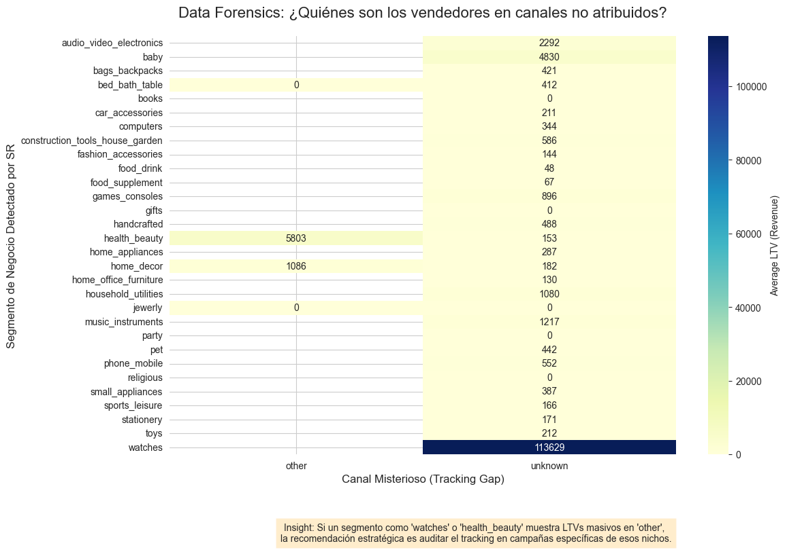

# 🚀 Olist Predictive Revenue Engine: Shark Detector
This project transforms raw data from Olist’s e-commerce ecosystem into a predictive revenue engine. Using advanced data forensics and machine learning techniques, the solution restores visibility into unattributed revenue and provides sales teams with a prioritization dashboard based on expected return on investment (Expected ROI).

--------------------------------------------------------------------------------
## 📊 Datasets Used
The project uses real-world data from **Olist**, the largest department store on Brazilian marketplaces.
The architecture connects two major ecosystems:
- [Brazilian E-Commerce Public Dataset](https://www.kaggle.com/datasets/olistbr/brazilian-ecommerce?resource=download): Data from 100,000 orders placed between 2016 and 2018. Includes price, payment, product attributes, and geographic location.
- [Marketing Funnel by Olist](https://www.kaggle.com/datasets/olistbr/marketing-funnel-olist): Información de 8,000 Marketing Qualified Leads (MQLs). Detalla el viaje del vendedor desde el registro en una landing page hasta el cierre del contrato por un Sales Representative (SR).
- Strategic Integration: The data was centralized in BigQuery and processed in Parquet format to optimize training speed and cloud computing costs [Previous Conversation].

--------------------------------------------------------------------------------
## 🔍 Data Forensics: The Discovery of $113,000
The core of this project stemmed from an in-depth audit of our attribution channels. Upon analyzing leads classified as “unknown” or “other,” we discovered a critical “attribution leakage.”

While the marketing team was unaware of the untracked traffic, forensic analysis revealed that:
- The watches segment on unknown channels has a massive average LTV (Lifetime Value) of $113,629.

- The Health and Beauty segment features high-volume sellers (“Sharks”) who enter through direct partnerships (other) with an LTV of $5,803.

**The Business Problem:** Due to the lack of UTM parameters, many of these “Sharks” were deprioritized by SDRs because their origin could not be identified, leaving millions of reais (R$) on the table.

--------------------------------------------------------------------------------
## 🤖 Predictive Engine Architecture
To address this, we developed a two-stage machine learning solution that does not rely solely on the lead’s source:
- Classification Stage (Lead Scoring): A Random Forest model validated using stratified K-folds to handle class imbalance. It predicts the **probability that a lead will become a seller**.
- Regression Stage (LTV Predictor): A regressor that **estimates the lead’s potential revenue** based on its business segment and historical behavior.

**Master KPI:** The console calculates the Expected ROI (Probability of Closing * Predicted LTV) in real time, allowing the sales team to call first those who will generate the most revenue, not those with the highest “probability.”

--------------------------------------------------------------------------------
## 💻 The App: SDR Priority Console
The **Streamlit** application serves as a tactical interface for the sales team. It allows users to simulate a “Customer Persona” profile and receive an immediate response from the model.
How It Works:
- **Data Input:** The user enters the business segment, lead type, and known source.
- **Real-Time Inference:** The system applies data forensics logic to detect whether the lead belongs to a luxury niche (Watches/Electronics) even if the channel is unknown.
- **Strategic Output:**
**a. Probability of Closing:** How close is the deal to closing?
**b. Potential LTV:** What is the long-term value of this contract?
**c. Expected ROI:** The final decision metric.
**d. Priority Alerts:** Automatic classification of leads into Cat, Wolf, or Shark.

--------------------------------------------------------------------------------
## 🛠 Tech Stack
**Data Warehouse:** BigQuery (Cloud-Native workflow)
**Processing:** Pandas, NumPy, Parquet.
**ML Engine:** Scikit-Learn (Random Forest, Stratified K-Folds).
**Deployment:** Streamlit Share (UI) & Docker (Containerization-Ready).
**Philosophy:** KISS - Robust, interpretable models aligned with business ROI.

--------------------------------------------------------------------------------
Author: Néstor Piedra Quesada - Machine Learning Engineer specializing in Marketing Analytics and Business Impact.
